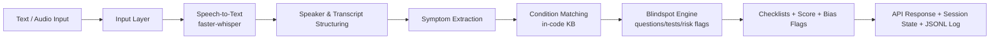
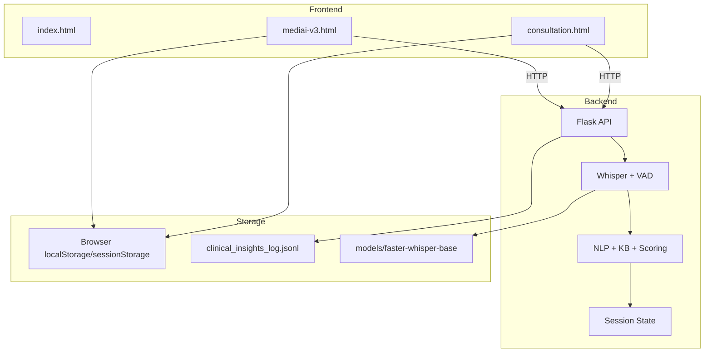

# 🩺 BlindSpot AI

> AI-assisted clinical conversation analysis to surface potentially overlooked symptoms, follow-ups, and alternative condition matches.

## 📌 Overview

BlindSpot AI is a healthcare decision-support prototype that analyzes consultation text or audio and highlights possible blind spots in clinical reasoning. It separates patient/doctor context, extracts symptoms, maps them against an internal medical knowledge base, and returns explainable outputs such as follow-up prompts, suggested tests, and unaddressed condition checks.

This project does **not** replace medical professionals. It is built as a second layer of scrutiny to support human judgment.

## 💡 Inspiration

In fast, high-pressure consultations, important clues can be missed—especially when symptoms overlap across multiple possibilities. BlindSpot AI was built around one guiding question:

**“What might we be missing?”**

Instead of acting like a final diagnosis engine, it adds an additional review layer that can flag inconsistencies, unaddressed symptoms, and prompts for deeper follow-up.

## 🎯 Problem Statement

Clinical conversations are complex. Patients may describe symptoms imprecisely, doctors must prioritize quickly, and subtle warning combinations can be overlooked. BlindSpot AI aims to reduce missed considerations by:

- Structuring noisy conversation input
- Tracking cumulative symptoms across a session
- Suggesting additional questions/tests based on detected patterns
- Highlighting conditions that may not yet be addressed in the dialogue

## ✨ What It Does

Implemented features in this repository:

- Flask API for consultation analysis (`/api/analyze/text`, `/api/analyze/audio`, `/api/analyze/live`)
- Voice-to-text transcription using `faster-whisper` (GPU-first, CPU fallback)
- Voice activity detection with `webrtcvad` and automatic energy-based fallback
- Heuristic speaker assignment (patient vs doctor) and mixed-dialogue splitting
- Symptom extraction via keyword/synonym/regex matching
- In-code medical knowledge base with weighted symptom-to-condition matching
- Blindspot detection outputs:
  - missed follow-up prompts
  - suggested tests
  - risk flags
- Consultation scoring and condition checklists
- Communication/bias phrase flagging (empathy/directive/dismissive/bias language cues)
- Session memory across turns + session reset/state endpoints
- JSONL logging of processed chunks (`clinical_insights_log.jsonl`)
- Frontend dashboard + consultation UI + local record/appointment utilities
- Browser audio recording upload to backend (`/api/analyze/audio`)

## 🧠 How It Works



## 🏗️ System Architecture

- **Backend (`clinical_blindspot.py`)**
  - End-to-end pipeline (audio capture/transcription/NLP/matching/output)
  - Flask server + health/session/analyze endpoints
- **Frontend (`frontend/*.html`)**
  - `index.html`: intro splash/video redirect
  - `mediai-v3.html`: dashboard UI + login + records + appointments + embedded clinical widget
  - `consultation.html`: focused conversation analysis page
- **Model assets (`models/faster-whisper-base/`)**
  - Local Whisper base model for offline/limited-connectivity runs
- **Local storage/logging**
  - Browser `localStorage/sessionStorage` for UI session, records, appointments
  - Server-side JSONL session log file



## 🛠️ Tech Stack

| Technology | Purpose | Where it is used |
|---|---|---|
| Python | Backend runtime | `clinical_blindspot.py`, scripts |
| Flask | REST API server | `clinical_blindspot.py` |
| faster-whisper | Speech-to-text inference | `clinical_blindspot.py` |
| Whisper base (CTranslate2 format) | Local ASR model assets | `models/faster-whisper-base/` |
| NumPy | Audio/numeric processing | `clinical_blindspot.py` |
| sounddevice | Live microphone capture (backend) | `clinical_blindspot.py` |
| soundfile | Audio decode + optional debug write | `clinical_blindspot.py` |
| webrtcvad (optional) | Voice activity detection | `clinical_blindspot.py` |
| HTML/CSS/Vanilla JS | Frontend UI | `frontend/*.html` |
| Web Speech API | Browser speech recognition (consultation page) | `frontend/consultation.html` |
| MediaRecorder + Web Audio API | Browser audio capture/encode for backend upload | `frontend/mediai-v3.html` |
| localStorage/sessionStorage | Client-side session, records, appointments | `frontend/mediai-v3.html`, `frontend/consultation.html` |
| Windows Batch scripts | One-click setup/run/stop workflow | root `*.bat` files |

## 📂 Project Structure

```text
BlindSpotAI/
├── clinical_blindspot.py
├── requirements.txt
├── launch_clinical_app.bat
├── stop_clinical_app.bat
├── setup_python_3_14_3.bat
├── setup_whisper_model.bat
├── clinical_insights_log.jsonl
├── temp_api_test.py
├── frontend/
│   ├── index.html
│   ├── mediai-v3.html
│   ├── consultation.html
│   └── welcome_intro.mp4
├── models/
│   └── faster-whisper-base/
│       ├── model.bin
│       ├── config.json
│       ├── tokenizer.json
│       ├── vocabulary.txt
│       └── README.md
└── README.md
```

## 🚀 Getting Started

### Prerequisites

- Python **3.14.x** (launcher scripts enforce 3.14)
- Windows PowerShell/Command Prompt (for `.bat` scripts)
- Microphone access (for live audio features)
- Optional GPU/CUDA for faster transcription

### Installation

#### Option A (recommended on Windows)

```bat
cd /d C:\path\to\BlindSpotAI
launch_clinical_app.bat
```

This installs dependencies, starts backend on `8000`, frontend static server on `5500`, and opens the app.

#### Option B (manual)

```bash
cd /home/runner/work/BlindSpotAI/BlindSpotAI
python -m pip install -r requirements.txt
python clinical_blindspot.py --mode server --host 127.0.0.1 --port 8000
```

In another terminal:

```bash
cd /home/runner/work/BlindSpotAI/BlindSpotAI/frontend
python -m http.server 5500
```

Open:

```text
http://127.0.0.1:5500/index.html
```

### Environment Variables

No `.env` file or required environment variables are currently defined in this repository.

If you add external integrations later, use placeholders like:

```env
API_KEY=your_api_key_here
```

### Running the Project

- Backend health check: `http://127.0.0.1:8000/health`
- Frontend entry: `http://127.0.0.1:5500/index.html`
- Default demo login (frontend):
  - Doctor: `doctor123`
  - Nurse: `nurse123`
  - Admin: `admin123`

## 🖥️ Usage

1. Launch backend + frontend.
2. Open dashboard (`mediai-v3.html`) via the intro page.
3. Sign in with a demo role/password and your display name.
4. Start consultation flow (`consultation.html`) from the nav.
5. Enter patient name, then:
   - paste conversation text, or
   - use browser voice capture.
6. Click **Analyze Conversation**.
7. Review:
   - patient symptom checklist
   - doctor action/remedy checklist
   - follow-up suggestions
   - possible condition matches
   - raw backend JSON output
8. Optionally save consultation records locally in browser storage.

## 🔍 Example Workflow

> **Illustrative example (not real medical advice or real patient data).**

Input dialogue:

- Patient: “I’ve had fatigue, weight loss, and increased thirst for weeks.”
- Doctor: “Take rest and a general supplement for now.”

BlindSpot AI can respond with outputs such as:

- Symptoms detected: fatigue, weight loss, thirst
- Possible conditions (ranked by score)
- Suggested follow-up questions for uncovered symptoms
- Suggested tests (e.g., HbA1c / fasting glucose from KB rules)
- Unaddressed condition checklist entries if doctor actions do not cover likely paths

## 🧪 Testing

There is no formal automated test suite configured yet.

A simple API smoke script exists:

```bash
cd /home/runner/work/BlindSpotAI/BlindSpotAI
python temp_api_test.py
```

Recommended next testing steps:

- Unit tests for symptom extraction and disease matching logic
- API endpoint contract tests (`/api/analyze/*`, `/api/session/*`)
- Frontend integration tests for key workflows
- Audio pipeline tests (record/upload/live)

## 🔐 Privacy & Responsible AI

- This project handles potentially sensitive health-related conversation content.
- Current frontend stores records in browser local storage; production use should move to secure, access-controlled storage.
- Outputs are heuristic and uncertainty-aware (ranked matches, follow-up prompts), not definitive conclusions.
- Human oversight is essential: clinicians remain the final decision-makers.
- Communication/bias flags are pattern-based cues and may produce false positives/negatives.

BlindSpot AI is a **decision-support educational prototype** and should be used responsibly.

## ⚠️ Limitations

- In-code, small medical knowledge base (not comprehensive)
- Rule/heuristic-driven extraction and matching (no clinical validation pipeline)
- No authentication hardening (demo credentials in frontend source)
- No persistent secure backend database; records are client-side local storage
- No production deployment configuration (dev-style local serving)
- No formal automated tests/CI in this repository
- Some broader concept elements from the project vision (e.g., deeper longitudinal context, robust medication-interaction engine, integration with external EHR/lab systems) are **not implemented here**

## 🏆 Accomplishments

- Built a full local end-to-end prototype (audio/text input → explainable clinical insight output)
- Implemented multi-endpoint Flask backend with session tracking
- Added both backend-mic and browser-recorded audio analysis flows
- Shipped a polished interactive frontend with consultation workflow and local records/appointments
- Included offline-capable local Whisper model path and fallback logic

## 📚 What We Learned

- Clinical decision-support UX needs clear explainability, not just ranked outputs
- Session-level context tracking improves usefulness over single-turn inference
- Audio pipelines require practical fallbacks (VAD fallback, GPU→CPU fallback)
- For health prototypes, responsible-AI framing and limitations are as important as technical features

## 🔮 What's Next

### Short-term improvements

- Add automated tests for extraction/matching/API behavior
- Add stronger input validation and error handling coverage
- Improve speaker diarization and conversation parsing robustness
- Replace hardcoded demo auth with secure authentication

### Long-term vision

- Expand and externalize the medical knowledge base
- Introduce calibrated confidence/uncertainty reporting
- Add secure backend persistence with audit trails
- Explore privacy-preserving architecture evolution aligned with the broader PrivateSense direction

## 🤝 Contributing

1. Fork the repository
2. Create a feature branch
3. Make focused changes with clear commit messages
4. Verify the app runs locally
5. Open a pull request with a concise summary

## 📄 License

> A license has not yet been specified.

## ⚕️ Disclaimer

BlindSpot AI is an AI-assisted clinical decision-support prototype for educational and research use. It does not provide medical diagnosis, does not replace licensed healthcare professionals, and should not be used as the sole basis for medical decisions. Always consult qualified clinicians for patient care.

## 👥 Team

Team/contributor details were not explicitly documented in this repository.
